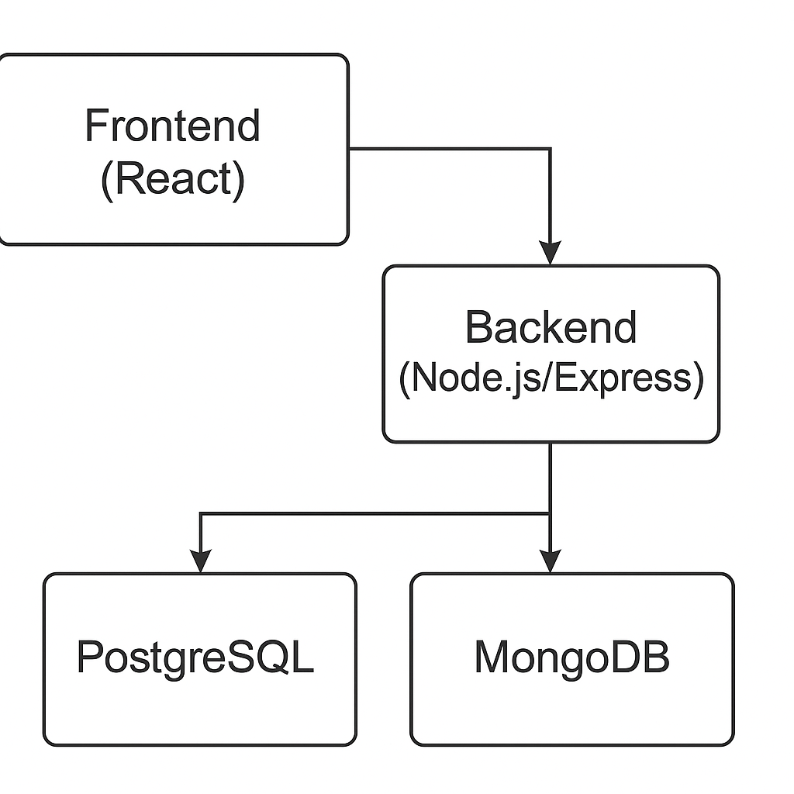

# Arquitectura de la aplicación

La plataforma de gestión de gimnasio de la Universidad Cali se ha diseñado con una **arquitectura en capas** que separa claramente la presentación, la lógica de negocio y el almacenamiento de datos. Esta separación facilita el mantenimiento, las pruebas y la escalabilidad del sistema.

## Componentes principales

1. **Frontend (React)**: Es una aplicación de una sola página (SPA) que proporciona una interfaz moderna y responsiva. Implementa componentes reutilizables para formularios, dashboards y visualización de gráficos. Maneja la autenticación mediante JSON Web Tokens (JWT) y envía peticiones al backend a través de HTTP/HTTPS.

2. **Backend API (Node.js/Express)**: Expone una API RESTful que gestiona la autenticación, la lógica de negocio y la conexión con las bases de datos. Implementa middlewares para la validación de datos, control de errores y autorización basada en roles. Utiliza bibliotecas nativas (pg) para conectarse a PostgreSQL y Mongoose para MongoDB.

3. **PostgreSQL**: Almacena los datos estructurados de la universidad (usuarios, roles, cursos) y las tablas propias de la aplicación: `app_user`, `assignment`, `user_monthly_stats` e `instructor_monthly_stats`. Su integridad referencial y soporte transaccional permiten gestionar operaciones críticas como la asignación de entrenadores y la generación de estadísticas mensuales.

4. **MongoDB**: Guarda las entidades dinámicas del sistema: ejercicios, rutinas, registros de progreso y recomendaciones. Gracias a su modelo documental, permite almacenar colecciones con estructuras anidadas y variables, ideal para representar rutinas con diferentes números de ejercicios y parámetros.

5. **Servicios de hosting** (opcional): La arquitectura es compatible tanto con despliegues en la nube como con instalaciones locales. Se pueden utilizar servicios como Supabase o Neon para PostgreSQL y MongoDB Atlas para la base NoSQL.

## Diagrama de arquitectura

El siguiente diagrama ilustra la interacción entre los componentes del sistema:

* El **frontend** se comunica con el **backend** a través de peticiones HTTP. Cada solicitud incluye un JWT para autorizar el acceso según el rol del usuario.
* El **backend** realiza consultas a **PostgreSQL** para autenticar usuarios, gestionar asignaciones y obtener estadísticas agregadas.
* Las operaciones que involucran rutinas, ejercicios o seguimiento se ejecutan en **MongoDB** a través de Mongoose, aprovechando su esquema flexible para almacenar documentos con estructuras variables.

## Flujo de autenticación

1. El usuario inicia sesión enviando sus credenciales al endpoint `/api/auth/login`. El backend valida las credenciales en la tabla `app_user` de PostgreSQL.
2. Si la autenticación es correcta, el backend emite un **token JWT** que contiene el `id` del usuario y su `role`. Este token debe enviarse en el encabezado `Authorization: Bearer` de cada petición subsecuente.
3. Para cada solicitud, un middleware comprueba la validez del token y, según el rol, se decide si el usuario puede ejecutar la acción (por ejemplo, solo un administrador puede asignar entrenadores).

## Flujo de uso de rutinas y progreso

1. El usuario consulta o crea ejercicios mediante los endpoints `/api/exercises`. Los entrenadores pueden crear o editar ejercicios predefinidos.
2. Los usuarios crean rutinas personalizadas o adoptan rutinas prediseñadas a través de `/api/routines` y `/api/routines/:id/adopt`. Las rutinas y sus ejercicios se almacenan como documentos en MongoDB.
3. Para registrar su progreso, el usuario envía datos a `/api/progress` indicando la rutina, ejercicio, número de repeticiones, duración y nivel de esfuerzo. Estos registros se guardan en la colección de progresos en MongoDB.
4. Periódicamente o bajo demanda, procesos de backend calculan estadísticas mensuales y las almacenan en las tablas de PostgreSQL (`user_monthly_stats` e `instructor_monthly_stats`), de modo que los administradores puedan generar informes rápidos mediante SQL.

## Consideraciones de escalabilidad y seguridad

* **Escalabilidad horizontal**: Tanto el backend como MongoDB soportan sharding y replicación, permitiendo distribuir la carga entre varios servidores. PostgreSQL puede escalar verticalmente y, mediante extensiones o servicios como Citus, también de forma horizontal.
* **Seguridad**: Se implementa cifrado TLS para todas las comunicaciones. PostgreSQL y MongoDB utilizan usuarios dedicados con privilegios mínimos. El backend aplica políticas de CORS y valida todos los datos de entrada para evitar inyecciones o ataques XSS.

Esta arquitectura híbrida proporciona una base sólida, mantenible y adaptable para el sistema de bienestar universitario, permitiendo añadir nuevas funcionalidades y soportar un número creciente de usuarios sin comprometer el rendimiento.