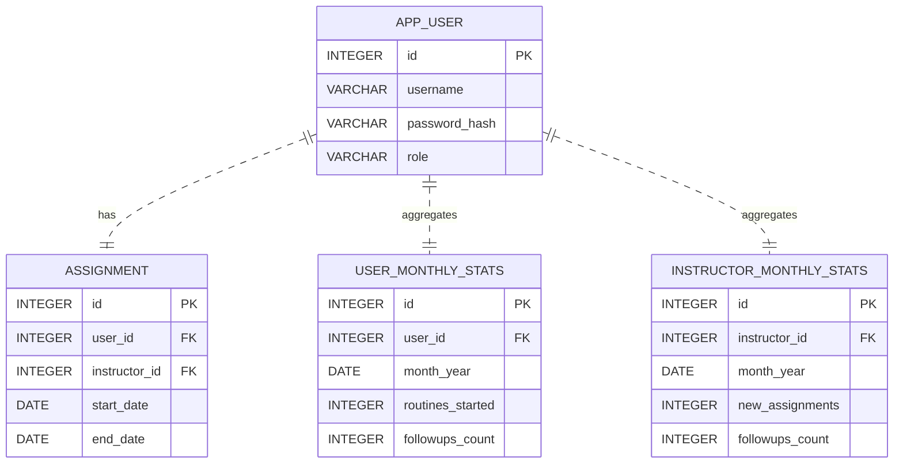

# Diagrama ER del esquema relacional `gym_app`

A continuación se muestra un diagrama ER simplificado de las tablas propias de la aplicación en PostgreSQL. Se emplea notación [Mermaid](https://mermaid.js.org/) para facilitar su visualización en plataformas compatibles.

Cada tabla tiene su clave primaria (*PK*) y referencia la clave foránea (*FK*) de usuarios o instructores almacenados en el sistema institucional. No se incluyen aquí las tablas del sistema universitario existente, pues forman parte de otro esquema.